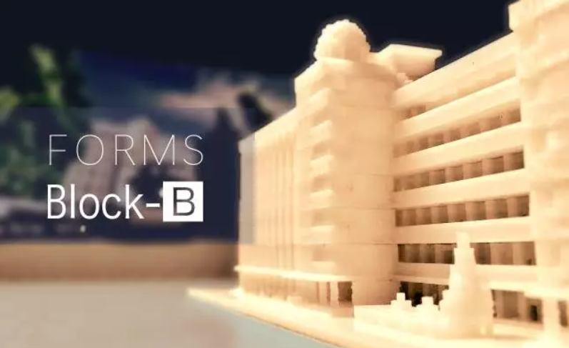
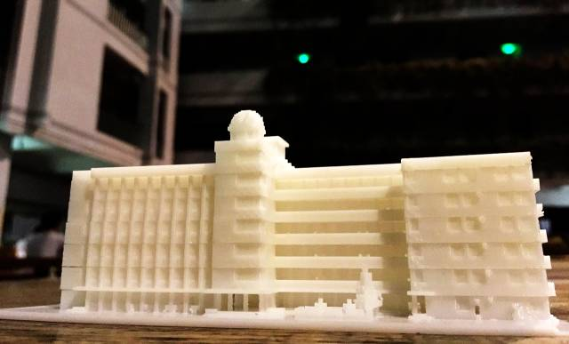
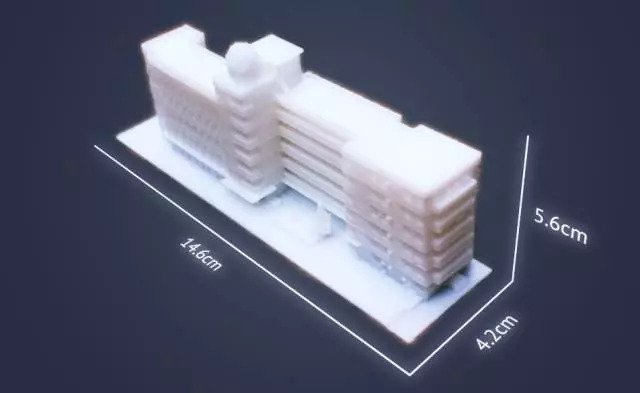
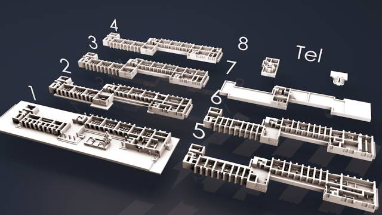
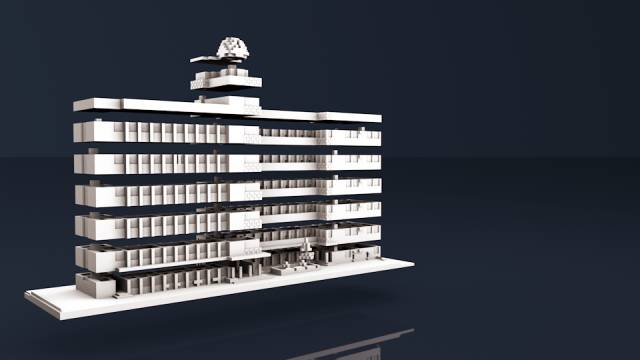
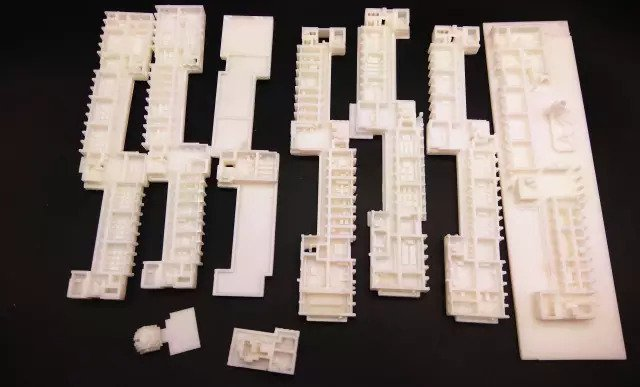

# FORMS Block-B

FORMS Block-B为我们在2017年元旦深中游园会上限量售卖的B栋拼接模型。模型化工作于2016年3月就已开始，历经近一年的迭代才完成。模型本身由九层3D打印的PLA板件拼接组合而成，每层都能够从模型上轻松拆下或装上；楼层中每个教室内都有与 FORMS 一致的内饰，基于2010年的深中高度还原。

[宣传稿 - FORMS | 献给你一座B栋](https://mp.weixin.qq.com/s/cgnd0ZEHpUPZ7TkLhkRQsQ)

